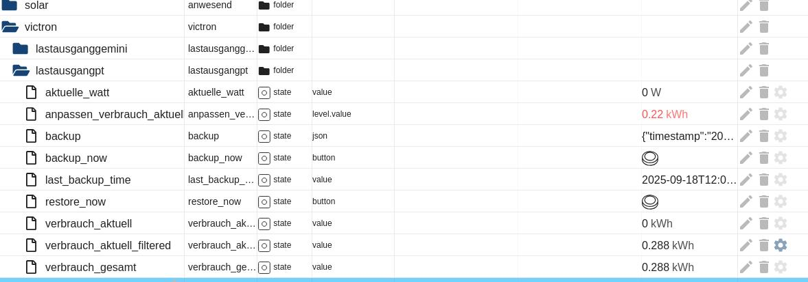

# Victron Load Monitor 🔋⚡

**Professionelle Überwachungslösung für Victron MPPT Solar-Laderegler mit Lastausgangsfunktion**

## Inhaltsverzeichnis

- [Übersicht](#-übersicht)
- [Systemarchitektur](#-systemarchitektur)
- [Hardwareanforderungen](#-hardwareanforderungen)
- [Softwarevoraussetzungen](#-softwarevoraussetzungen)
- [Installationsanleitung](#-installationsanleitung)
- [Datenpunkte & Überwachung](#-datenpunkte--überwachung)
- [Technische Spezifikationen](#-technische-spezifikationen)
- [Konfiguration & Anpassung](#%EF%B8%8F-konfiguration--anpassung)
- [Überwachung & Verifizierung](#-überwachung--verifizierung)
- [Fehlerbehebung](#-fehlerbehebung)
- [Anwendungsfälle](#-anwendungsfälle)
- [Mitwirken](#-mitwirken)
- [Lizenz](#-lizenz)
- [Danksagungen](#-danksagungen)
- [Beispielbilder](#beispielbilder)
- [Besonderer Dank für Unterstützung](#-besonderer-dank-für-unterstützung-aus-folgenden-telegram-gruppen)

## 📖 Übersicht

Dieses Projekt ermöglicht die präzise Überwachung des Lastausgangs von Victron MPPT Solar-Ladereglern und liefert Echtzeit-Verbrauchsdaten mit fortschrittlicher Filterung und Analyse. Das System erfasst die Leistungsaufnahme in Watt und berechnet den Energieverbrauch in kWh sowohl für die tägliche Nachverfolgung als auch für die gesamte Lebensdauer.

### Hauptfunktionen

- Echtzeit-Lastüberwachung: Kontinuierliche Messung der Ausgangsleistung (W)  
- Energieverbrauchsverfolgung: Tägliche kWh-Akkumulation mit automatischem Mitternachts-Reset  
- Lebensdauerzählwerk: Gesamtenergieverbrauch über die gesamte Betriebszeit  
- Erweiterte Datenverarbeitung:
  - EMA (Exponentieller gleitender Durchschnitt) zur Glättung
  - Ausreißer-Erkennung und Filterung für bessere Genauigkeit
  - Nullwert-Filterung bei Standby des Reglers
- Datenverwaltung:
  - Manuelle Verbrauchsanpassung möglich
  - Backup- und Restore-Funktion
  - Persistente Speicherung bei Neustarts
- Hohe Empfindlichkeit: Optimiert für kleine Lastschwankungen und Niedrigverbrauch

## 🏗 Systemarchitektur

ASCII-Darstellung der Datenfluss-Architektur:

┌─────────────────┐   VE.Direct    ┌─────────────────┐   MQTT     ┌─────────────────┐   JavaScript    ┌─────────────────┐  
│                 │ ───────────►   │                 │ ────────►  │                 │ ─────────────►  │                 │  
│  Victron MPPT   │                │  ESP82XX mit    │            │    ioBroker     │                 │  Lastmonitor    │  
│  Laderegler     │                │  Victron2MQTT   │            │    MQTT         │                 │     Script      │  
│                 │                │    Firmware     │            │    Adapter      │                 │                 │  
└─────────────────┘                └─────────────────┘            └─────────────────┘                 └─────────────────┘  
       |                                     |                              |                                  |  
       |                                     |                              |                                  |  
Lastausgang                        Seriell/MQTT Bridge              Nachrichtenverarbeitung                    Datenanalyse  
Messung                             Datenkonvertierung              Protokollhandling                           & Visualisierung

## 🔧 Hardwareanforderungen

### Wesentliche Komponenten

1. Victron MPPT Solar-Laderegler  
   - Muss Lastausgangsfunktion haben  
   - Kompatible Modelle: 75/10, 75/15, 100/15, 100/20  
   - VE.Direct-Port erforderlich

2. ESP82XX Mikrocontroller  
   - ESP8266 oder ESP32 Board  
   - Mindestens 4 MB Flash empfohlen  
   - WLAN für MQTT-Kommunikation

3. VE.Direct-Kabel  
   - Verbindung ESP ↔ VE.Direct-Port des Victron-Reglers

### Unterstützte Victron-Modelle

| Modellreihe   | Lastausgang | VE.Direct | Kompatibel |
|---------------|-------------|-----------|------------|
| MPPT 75/10    | ✅ Ja       | ✅ Ja     | ✅ Ja      |
| MPPT 75/15    | ✅ Ja       | ✅ Ja     | ✅ Ja      |
| MPPT 100/15   | ✅ Ja       | ✅ Ja     | ✅ Ja      |
| MPPT 100/20   | ✅ Ja       | ✅ Ja     | ✅ Ja      |
| MPPT 100/30   | ❌ Nein     | ✅ Ja     | ❌ Nein    |
| MPPT 100/50   | ❌ Nein     | ✅ Ja     | ❌ Nein    |

## ⚙️ Softwarevoraussetzungen

Benötigter Software-Stack:

1. ioBroker Installation  
   - Version 4.0+ empfohlen  
   - JavaScript-Adapter aktiviert  
   - MQTT-Adapter konfiguriert

2. ESP Firmware: Victron2MQTT  
   - Repository: https://github.com/softwarecrash/Victron2MQTT  
   - Firmware auf ESP82XX flashen  
   - WLAN- und MQTT-Broker-Einstellungen konfigurieren

3. MQTT-Broker  
   - Lokaler Broker (z. B. Mosquitto) oder Cloud-Service  
   - Muss sowohl vom ESP als auch von ioBroker erreichbar sein

## 🚀 Installationsanleitung

### Schritt 1: Hardware-Setup

- VE.Direct-Kabel anschließen: Victron Controller [VE.Direct] ──── [ESP82XX]  
- ESP mit Strom versorgen: kann über Victron 5V-Ausgang (falls vorhanden) oder separates USB/DC-Netzteil erfolgen

### Schritt 2: ESP Firmware installieren

- Repository klonen (einzeilig): `git clone https://github.com/softwarecrash/Victron2MQTT.git`  
- WLAN-Zugangsdaten und MQTT-Broker-Einstellungen in der Firmware konfigurieren  
- Firmware auf ESP82XX flashen  
- Prüfen, ob MQTT-Topics ankommen (z. B. `mqtt.0.Victron.Load_current`, `mqtt.0.Victron.Voltage`)

### Schritt 3: ioBroker-Skript installieren

- ioBroker Admin-Interface öffnen: `http://deine-iobroker-ip:8081`  
- Admin → Skripte → JavaScript  
- Neues Skript erstellen: Name "Victron Load Monitor"  
- `.js`-Datei aus dem Repository herunterladen und gesamten Inhalt in den Script-Editor kopieren  
- Skript speichern und aktivieren (Schalter auf ON)  
- Logs auf Initialisierungsnachrichten prüfen

## 📊 Datenpunkte & Überwachung

Generierte Datenpunkte:

| Datenpunkt | Typ | Beschreibung | Einheit | Aktualisierungsrate |
|------------|-----|--------------|---------|---------------------|
| `verbrauch_aktuell` | Number | Täglicher Energieverbrauch | kWh | Echtzeit |
| `verbrauch_gesamt`  | Number | Lebenszeit-Energieverbrauch | kWh | Echtzeit |
| `aktuelle_watt`     | Number | Aktuelle Lastleistung (geglättet) | W | Alle 5 s |
| `anpassen_verbrauch_aktuell` | Number | Manuelle Tagesanpassung | kWh | On-Demand |
| `backup_now`        | Button | Backup auslösen | - | On-Demand |
| `restore_now`       | Button | Restore auslösen | - | On-Demand |

Datenverarbeitungspipeline (Beschreibung):  
Raw MQTT Data → Outlier Filter → EMA Smoothing → kWh Calculation → Storage

- Ausreißererkennung: Filtert Werte außerhalb sinnvoller Bereiche  
- EMA-Glättung: Reduziert Rauschen mit konfigurierbarem Alpha-Faktor  
- Energieintegration: Wandelt Leistung (W) in Energie (kWh) um  
- Persistente Speicherung: Automatisches stündliches Backup

## 🔍 Technische Spezifikationen

Algorithmus- und Betriebsdetails:

- EMA Alpha-Faktor: 0.3 (konfigurierbar)  
- Abtastrate: 5 Sekunden  
- Integrationsmethode: Trapezregel zur kWh-Berechnung  
- Täglicher Reset: 00:00:00  
- Backup-Intervall: Stündlich

Leistungsmerkmale:

- Minimal messbare Last: 1 Watt  
- Genauigkeit: ±2% bei Lasten > 10 W  
- Reaktionszeit: < 30 Sekunden bei Laständerungen  
- Speicherverbrauch: ~50 KB/Monat  
- CPU-Auslastung: < 1% auf typischen ioBroker-Systemen

## 🛠️ Konfiguration & Anpassung

Konfigurationsbeispiel (als Klartext, in dein Script übernehmen):

const CONFIG = {  
    emaAlpha: 0.3,              // EMA-Glättungsfaktor (0.1-0.9)  
    updateInterval: 5000,       // Aktualisierungsintervall in ms  
    backupInterval: 3600000,    // Backup-Intervall in ms (1 Stunde)  
    outlierThreshold: 1000,     // Max. sinnvolle Leistung in Watt  
    minValidPower: 0.1          // Minimale Leistung, die als gültig betrachtet wird  
};

MQTT-Topic-Konfiguration (Beispiele):

- mqtt.0.Victron.Load_current  (Ampere)  
- mqtt.0.Victron.Voltage       (Volt)

## 📈 Überwachung & Verifizierung

24-Stunden-Validierungsprozess (Kurz):

1. Skriptstatus prüfen (z. B. im ioBroker-Log).  
2. Datenfluss überwachen: `aktuelle_watt` alle 5 s, `verbrauch_aktuell` sollte im Tagesverlauf steigen.  
3. Vergleich mit VictronConnect-App: tägliche kWh-Werte vergleichen und Abweichungen dokumentieren.  
4. Backup/Restore testen: manuelles Backup, Skript neu starten, Datenpersistenz prüfen.

Debug-Hinweise (Beispiele als Klartext zum Einfügen ins Script):

log("Aktuelle Leistung: " + getState("mqtt.0.Victron.Load_current").val + " A");  
log("Spannung: " + getState("mqtt.0.Victron.Voltage").val + " V");  
log("Berechnete Watt: " + calculated_watts);

## 🔧 Fehlerbehebung

Häufige Probleme & Lösungen:

| Problem | Symptome | Lösung |
|--------|----------|--------|
| Keine MQTT-Daten | `aktuelle_watt` zeigt 0 | ESP-Verbindung prüfen, MQTT-Topics kontrollieren |
| Starke Schwankungen | Fluktuierende Werte | EMA-Alpha anpassen, Kabel prüfen |
| Täglicher Reset fehlt | Kein Mitternachts-Reset | System-Zeitzone prüfen, Logs ansehen |
| Backup-Fehler | Datenverlust nach Neustart | ioBroker-Berechtigungen prüfen, Speicherpfad kontrollieren |

## 📋 Anwendungsfälle

Typische Einsatzgebiete:

- Off-grid-Hütten: Tagesverbrauch überwachen  
- Wohnmobile / Caravans: 12V-Geräte überwachen  
- Boote: Batterienutzung beim Ankern optimieren  
- Kleine Solaranlagen: Detaillierte Lastanalyse für Systemdimensionierung  
- Forschungsprojekte: Hochauflösende Verbrauchsstudien

Besonders geeignet für Lastbereiche 5 W bis 360 W und Systeme mit variablen Lasten.

## 🤝 Mitwirken

Beiträge willkommen — mögliche Bereiche: Visualisierung, Multi-Geräte-Support, bessere Filteralgorithmen, Mobile-Integration, historische Analysewerkzeuge.

## Beispielbilder

(Platzhalter für Bilder im Repo)

<figure style="display: inline-block; border: 2px solid black; background-color: #f9f9f9; padding: 10px; margin: 10px; text-align: center; border-radius: 8px;">
  <figcaption><strong>ioBroker Datenpunkte</strong></figcaption>
  
</figure>

<figure style="display: inline-block; border: 2px solid black; background-color: #f9f9f9; padding: 10px; margin: 10px; text-align: center; border-radius: 8px;">
  <figcaption><strong>Victron App VS Visualisierung IoBroker</strong></figcaption>
  
</figure>

## 📄 Lizenz

Dieses Projekt ist unter der MIT-Lizenz lizenziert — siehe Datei `LICENSE` für Details.

## 🙏 Danksagungen

- Victron Energy für Dokumentation und offene Schnittstellen  
- softwarecrash für das Victron2MQTT-Projekt  
- ioBroker-Community  
- ESP-Community

## 🏆 Besonderer Dank für Unterstützung aus folgenden Telegram-Gruppen

- https://t.me/PV_Solaranlage  
- https://t.me/TasmotaDE

Für Probleme, Fragen oder Beiträge: Issues-Sektion oder Wiki im Repository konsultieren.

## 📞 Support ❌ Nein

**Viel Erfolg beim Monitoring! ⚡🔋**
